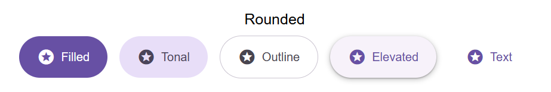
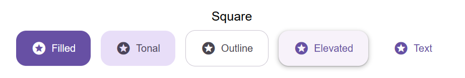

# Buttons

> **_HTML + CSS_**

Put this in your `<head>` for material icons

```html
<link
  rel="stylesheet"
  href="https://fonts.googleapis.com/icon?family=Material+Icons"
/>
```

## Rounded buttons



**_HTML Code_**

```html
<!-- Filled button -->
<button class="rounded filled">
  <i class="material-icons">stars</i>
  Filled
</button>

<!-- Tonal button -->
<button class="rounded tonal">
  <i class="material-icons">stars</i>
  Tonal
</button>

<!-- Outlined button -->
<button class="rounded outlined">
  <i class="material-icons">stars</i>
  Outline
</button>

<!-- Elevated button -->
<button class="rounded elevated">
  <i class="material-icons">stars</i>
  Elevated
</button>

<!-- Text button -->
<button class="rounded text">
  <i class="material-icons">stars</i>
  Text
</button>
```

**_CSS Code_**

```css
/* Rounded button style */
.rounded {
  padding: 16px 24px;
  border: none;
  display: flex;
  align-items: center;
  justify-items: center;
  gap: 8px;
  width: fit-content;
  border-radius: 5000px;
}

/* Filled button style */
.filled {
  background-color: #6750a4;
  color: #ffffff;
}

/* Tonal button style */
.tonal {
  background-color: #e8def8;
  color: #4a4459;
}

/* Outlined button style */
.outlined {
  color: #49454f;
  border: 1px solid #cac4d0;
}

/* Elevated button style */
.elevated {
  background-color: #f7f2fa;
  color: #6750a4;
  box-shadow: 0px 1px 2px 0px rgba(0, 0, 0, 0.3), 0px 2px 6px 2px rgba(0, 0, 0, 0.15);
}

/* Text button style */
.text {
  color: #6750a4;
}
```

## Square buttons



**_HTML Code_**

```html
<!-- Filled button -->
<button class="square filled">
  <i class="material-icons">stars</i>
  Filled
</button>

<!-- Tonal button -->
<button class="square tonal">
  <i class="material-icons">stars</i>
  Tonal
</button>

<!-- Outlined button -->
<button class="square outlined">
  <i class="material-icons">stars</i>
  Outline
</button>

<!-- Elevated button -->
<button class="square elevated">
  <i class="material-icons">stars</i>
  Elevated
</button>

<!-- Text button -->
<button class="square text">
  <i class="material-icons">stars</i>
  Text
</button>
```

**_CSS Code_**

```css
/* Square button style */
.square {
  padding: 16px 24px;
  border: none;
  display: flex;
  align-items: center;
  justify-items: center;
  gap: 8px;
  width: fit-content;
  border-radius: 16px;
}

/* Filled button style */
.filled {
  background-color: #6750a4;
  color: #ffffff;
}

/* Tonal button style */
.tonal {
  background-color: #e8def8;
  color: #4a4459;
}

/* Outlined button style */
.outlined {
  color: #49454f;
  border: 1px solid #cac4d0;
}

/* Elevated button style */
.elevated {
  background-color: #f7f2fa;
  color: #6750a4;
  box-shadow: 0px 1px 2px 0px rgba(0, 0, 0, 0.3), 0px 2px 6px 2px rgba(0, 0, 0, 0.15);
}

/* Text button style */
.text {
  color: #6750a4;
}
```
